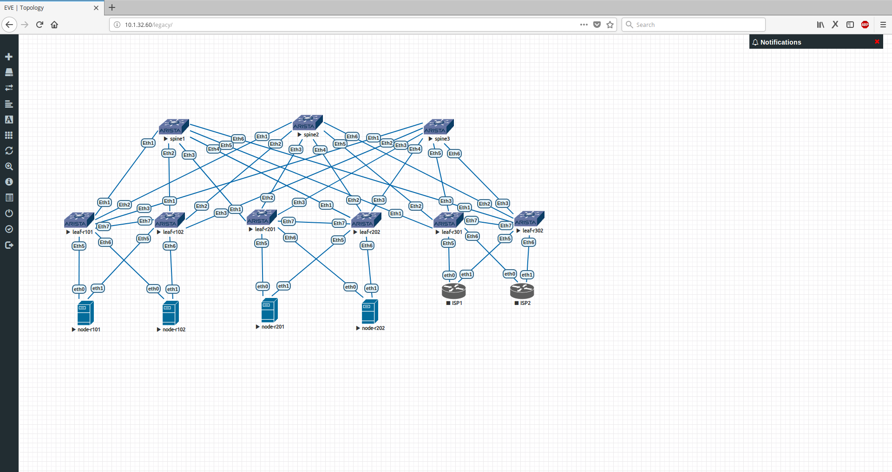

# arista-l3fabric-bgp-evpn-config
Arista EOS L3Fabric EVPN

Environmnet:
Spine/Leaf switches - Arista 4.18.5M
Node - VyOS 1.1.7
ISP - VyOS 1.1.7

IP addressing:

Topology

Cheatsheet/Commonly used terms:
